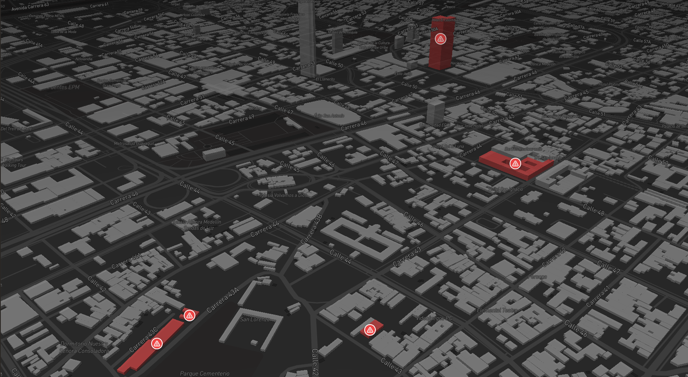

# Spybee Technical Test



Aplicación de gestión de incidentes para edificios. Permite registrar, visualizar y administrar incidencias de forma visual y estructurada.

La aplicación se compone de dos módulos principales:

- **Incidentes**: panel de estadísticas con filtro de periodo, mapa de calor y listado paginado con ordenamiento. Permite revisar el estado, prioridad y fechas de cada incidencia desde la tabla.
- **Mapa**: vista geográfica interactiva para ubicar incidencias, consultar su detalle y crear nuevas incidencias directamente desde el mapa.

## Stack

- **Framework:** Next.js 16 (App Router) + React 19 + TypeScript 6
- **Base de datos:** PostgreSQL + Drizzle ORM + `drizzle-kit`
- **Autenticación:** Supabase SSR (`@supabase/ssr`)
- **Gestión de estado local:** Zustand
- **Fetching y cacheo de datos:** TanStack Query
- **Formularios:** React Hook Form + Zod
- **UI base:** `@base-ui/react` + SCSS Modules
- **Mapas:** Mapbox GL
- **Lint / Format:** Biome 2.4
- **Gestor de paquetes:** pnpm

## Estructura

```
src/
├── app/              # Rutas de Next.js (App Router)
│   ├── (auth)/       # Login con magic link y GitHub
│   └── (dashboard)/  # App protegida: /incidentes y /mapa
├── contexts/         # Dominio: entidades, value objects y factories
│   └── building/incidents/domain/
├── core/             # Infraestructura compartida
│   ├── auth/         # Clientes Supabase (browser/server)
│   ├── db/           # Schema, tipos y migraciones de Drizzle
│   ├── env.ts        # Variables de entorno validadas
│   ├── query/        # Cliente y provider de TanStack Query
│   └── ui/           # Componentes primitivos del design system
└── features/         # Módulos por feature
    ├── auth/
    ├── incident-list/
    ├── incident-heatmap/
    ├── incident-stats/
    ├── incident-creation/
    ├── incident-detail/
    ├── incidents/    # actions, queries, mutations y mappers
    ├── map/
    └── toolbar/
```

## Módulos principales

| Módulo | Descripción |
|--------|-------------|
| `auth` | Inicio de sesión con magic link y OAuth de GitHub. Middleware de protección de rutas. |
| `incidents` | Server Actions, queries, mutations y mappers para crear, actualizar y listar incidencias. |
| `incident-list` | Tabla paginada y ordenable de incidencias con badges de estado y prioridad. |
| `incident-heatmap` | Mapa de calor de incidencias agrupadas por ubicación. |
| `incident-stats` | Panel de estadísticas y métricas del conjunto de incidencias. |
| `incident-creation` | Formulario de alta de incidencias con soporte para archivos adjuntos. |
| `incident-detail` | Diálogo de detalle y edición de una incidencia. |
| `map` | Mapa interactivo (Mapbox) para ubicar y seleccionar incidencias. |
| `toolbar` | Barra de herramientas del mapa con acciones de creación y filtros. |

## Requisitos

- Node.js 20+
- pnpm
- PostgreSQL
- Cuenta de Supabase
- Token de acceso de Mapbox

## Variables de entorno

Crea un archivo `.env.local` en la raíz:

```env
# Servidor
BASE_URL=http://localhost:3000
DATABASE_URL=postgresql://...
NODE_ENV=development

# Cliente
NEXT_PUBLIC_BASE_URL=http://localhost:3000
NEXT_PUBLIC_MAPBOX_ACCESS_TOKEN=...
NEXT_PUBLIC_SUPABASE_URL=...
NEXT_PUBLIC_SUPABASE_PUBLISHABLE_KEY=...
```

## Convenciones

- Usa `~/` para imports cross-module.
- Named exports por defecto; default exports solo en `page.tsx`, `layout.tsx` y `route.ts`.
- Los estilos se escriben en SCSS Modules junto al componente.
- Los tipos se derivan de Zod.
- Las Server Actions validan sesión e inputs antes de mutar.

Para más detalles, consulta [`AGENTS.md`](./AGENTS.md).
